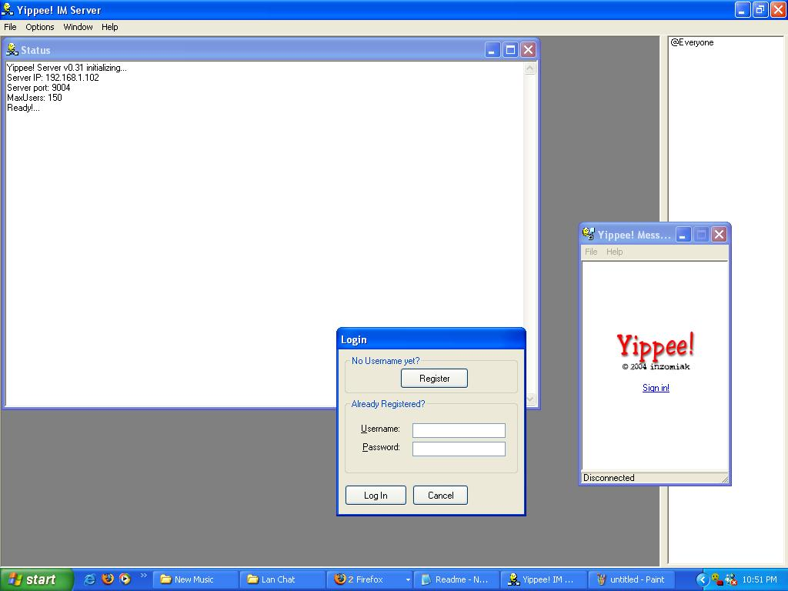



## Instant Messenger/Remote Desktop Viewer

### Description

This is a server/client IM messenger that currently:

<ul>

<li> allows users to chat to one another.

<li> upload an avatar picture.

<li> send files.

<li> allows the server to see what a user is up to on their workstation.

</ul>

It is intended for LAN networks, specifically in schools, where the server would be

running on the instructors PC. The teacher could then see whatever the students are doing.

while allow the students to chat among themselves, and send files.

The server can also distribute a file to all the students but only one at a time.

Uses Winsock UDP and TCP.

See documentation (included) for message protocols.

Needs CRC.dll and zlib32.dll available here:  http://www.geocities.com/saintender.geo/vgs/dlls.zip
 
### More Info
 

             |
---                |---
**Submitted On**   |2005-10-25 19:34:30
**By**             |[David Santos](https://github.com/Planet-Source-Code/PSCIndex/blob/master/ByAuthor/david-santos.md)
**Level**          |Advanced
**User Rating**    |4.9 (54 globes from 11 users)
**Compatibility**  |VB 5\.0, VB 6\.0
**Category**       |[Miscellaneous](https://github.com/Planet-Source-Code/PSCIndex/blob/master/ByCategory/miscellaneous__1-1.md)
**World**          |[Visual Basic](https://github.com/Planet-Source-Code/PSCIndex/blob/master/ByWorld/visual-basic.md)
**Archive File**   |[Instant\_Me19481311132005\.zip](https://github.com/Planet-Source-Code/david-santos-instant-messenger-remote-desktop-viewer__1-61397/archive/master.zip)

